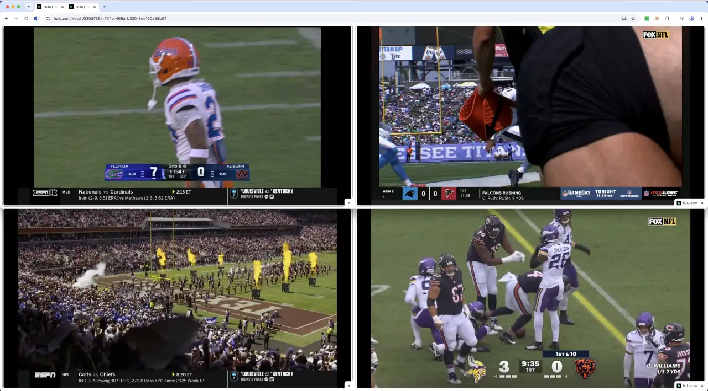

<p align="center">
  
</p>

# Kickoff

Kickoff is a native macOS menu bar app that sets up two Google Chrome panes on a chosen monitor.
It mutes ads when detectable.



## Requirements

- macOS 13 or later
- Google Chrome with split view available
- Swift 5.9 or later when building from source

Before using Kickoff, enable [chrome://flags/#enable-tab-audio-muting](chrome://flags/#enable-tab-audio-muting) in Chrome and relaunch Chrome when prompted.

## Build and launch

```sh
git clone https://github.com/strefethen/kickoff.git
cd kickoff
./build-app.sh
open build/Kickoff.app
```

Kickoff needs macOS Accessibility permission to arrange and control Chrome. Choose **Open Accessibility Settings…** from Kickoff’s menu, then add and enable Kickoff under **Privacy & Security → Accessibility**.

## Use Kickoff

1. Open Kickoff’s menu bar menu, then choose a display from **Monitor**.
2. Choose **Settings…**, enter the **Website URL**, and select **Save**.
3. Choose **Set Up Chrome on [monitor]**.

Kickoff uses the selected monitor for future setup runs. If that monitor is unavailable, it chooses an available monitor without replacing the saved preference.

Changing the Website URL affects the next setup run. It does not navigate Chrome panes that are already open.

## Tests

```sh
swift test
```

## License

[MIT](LICENSE)
