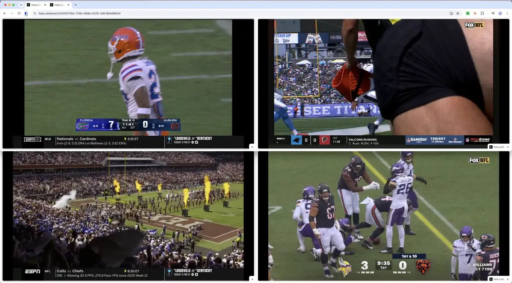
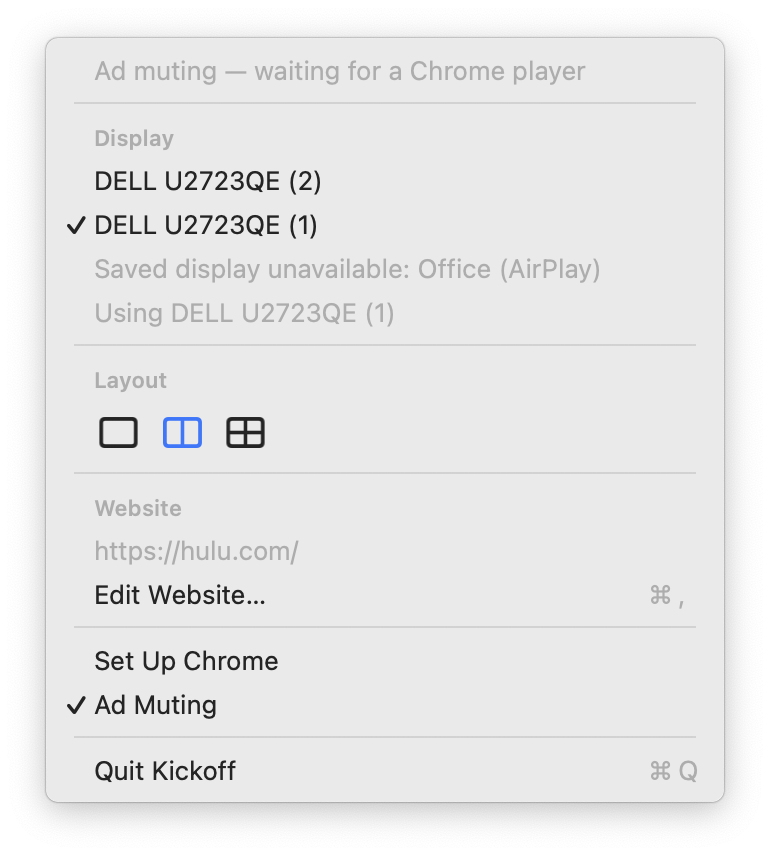

<p align="center">
  
</p>

# Kickoff

Kickoff is a native macOS menu bar app that sets up one, two, or four Google Chrome panes on a chosen monitor.
It mutes detectable ads on Hulu and Peacock (experimental).



## Requirements

- macOS 14 or later
- Apple Silicon Mac
- Google Chrome with split view available
- Swift 5.9 or later when building from source

Before using Kickoff, enable [chrome://flags/#enable-tab-audio-muting](chrome://flags/#enable-tab-audio-muting) in Chrome and relaunch Chrome when prompted.

## Install

1. Download the latest `Kickoff-<version>-arm64.zip` from [GitHub Releases](https://github.com/strefethen/kickoff/releases).
2. Unzip the download and move `Kickoff.app` to `/Applications`.
3. Open Kickoff, choose **Open Accessibility Settings…** from its menu, then enable Kickoff under **Privacy & Security → Accessibility** so it can arrange and control Chrome.

## Build and launch

```sh
git clone https://github.com/strefethen/kickoff.git
cd kickoff
./build-app.sh
open build/Kickoff.app
```

Maintainer release instructions are in [docs/releasing.md](docs/releasing.md).

## Use Kickoff



1. Open Kickoff’s menu and choose a **Display**.
2. Choose a **Layout**: single, split, or quad.
3. Use **Edit Website…** to change the URL shown in the menu.
4. Choose **Set Up Chrome**.

Kickoff uses the selected monitor for future setup runs. If that monitor is unavailable, it chooses an available monitor without replacing the saved preference.

Changing the Website URL affects the next setup run. It does not navigate Chrome panes that are already open.

## Tests

```sh
swift test
```

## License

[MIT](LICENSE)
